# Paid video course

The purchase, the learner area, and the assessed certification path. Phase 1 was built across
five sub-plans, 1a to 1e; the shots below come from the four that produced something to look at,
because 1a built the content collections, the catalog validator and the pure rule modules, which
are proved by `npm test` rather than by a screenshot. Verified end to end in a real browser
against the local Supabase stack: a real Stripe test-mode purchase, real autosaves, and two real
grades from `claude-opus-5`. See [../../roadmap.md](../../roadmap.md) Phase 6 for the plan and
[../../status.md](../../status.md) for what remains. Phase 2 added the module checks, the admin
preview of a staged lesson, the content ladder, the free lesson page and the resources page; its
shots follow the Phase 1 rows. The free lesson page has no shot yet, because the preview lesson
is still a draft and a page of placeholder copy would show nothing true. Phase 3a added the
attempt history, the read-only earlier attempt and the retake path, and its shots follow the
Phase 2 rows. Phase 3b added certificates and the public verification page; its shots close the
table.

The public pages were captured with `PUBLIC_COURSE_STATUS=preview`, because production stays
`hidden` through the pilots. That is why the sales page and the pricing panel say "Opens soon"
rather than carrying a price.

| Screenshot | What it shows |
|---|---|
|  | **`course-sales-preview-1280.png`**: the `/course` sales page in preview mode, with the syllabus built from the catalog, the certification section, and a CTA reading "Opens soon" instead of a price. That last part is what proves the launch flag gates the offer itself, not only the wording. |
|  | **`course-sales-preview-390.png`**: `/course` at 390px. The hero, the first CTA and the syllabus stack into one column, so a phone visitor reaches the offer and the lesson list without a sideways scroll. |
|  | **`course-dashboard-buy-state-1280.png`**: `/course/learn` for a signed-in account with no enrollment. No lesson content is present, only the invitation to buy, and because the page is a shell there is nothing in the source either. |
|  | **`course-dashboard-ready-1280.png`**: `/course/learn` after a completed purchase. The enrollment is recognised through `/api/course/entitlement` and the module list, progress and worksheets appear. |
|  | **`course-dashboard-start-here-1280.png`**: the derived resume pointer. "Start here" lands on the first lesson the learner has not finished, rather than on a stored bookmark that could go stale. |
|  | **`course-lesson-390.png`**: a lesson at 390px. The Cloudflare Stream player on a signed token, the sections drawer and the practice editor are all usable on a phone. |
|  | **`course-lesson-complete-1280.png`**: a lesson the learner has explicitly completed. The model response is revealed, the self-review is visible, the completion is recorded, and the next lesson is linked. |
|  | **`course-worksheet-print-1280.png`**: the print view of a module worksheet, with the site chrome dropped and writing room under each prompt. The printable worksheet is a stylesheet, never a generated PDF. |
|  | **`course-worksheet-390.png`**: on screen at 390px rather than on paper. Each prompt keeps its writing space and stays legible at a phone's default text size, so a module can be worked through on the device it was read on. |
|  | **`assessment-part-b-open-1280.png`**: the assessment once Part A has locked. Part B's reveal is visible and the Part A answers are read-only, which is the whole point of the staging: a reveal can only follow a stage that locks. |
|  | **`assessment-part-b-open-390.png`**: Part B at 390px. The reveal, the live prompt and the locked Part A answers all sit in one column, so nothing a learner must read before answering ends up off-screen. |
|  | **`assessment-grading-in-progress-1280.png`**: just after submitting. The attempt is frozen, the job is queued for the background worker, and the island polls for the result. Nothing is editable while a grade is in flight. |
|  | **`assessment-result-passed-1280.png`**: a real pass from `claude-opus-5`. Per-criterion scores against the published rubric, each carrying a quote copied verbatim from the learner's own response, and revision lessons drawn only from the form's allowed list. |
|  | **`assessment-result-passed-390.png`**: at 390px every criterion still keeps its score, its reason and the quote it rests on, which matters because a phone is where most people will read a grade. |
|  | **`assessment-grading-error-1280.png`**: the grading-error panel. It leads with course support and says plainly that this is not a failed attempt, because a failure in our infrastructure must never read as a verdict on the learner. |
|  | **`dashboard-certification-card-grading-error-1280.png`**: a learner who navigated away from the assessment still finds out, because the dashboard's certification card carries the grading-error state too. |
|  | **`admin-grading-queue-1280.png`**: `/admin` → Grading. Every job with its state, attempt count and lease, plus Retry (re-queue a failed job with a fresh budget) and Kick (re-trigger the worker without waiting for the sweeper). |
|  | **`admin-enrollments-1280.png`**: `/admin` → Enrollments. Every enrollment with its status and source, and the grant, revoke, record-refund and reinstate actions. Each writes a ledger row naming the admin who did it. |
| 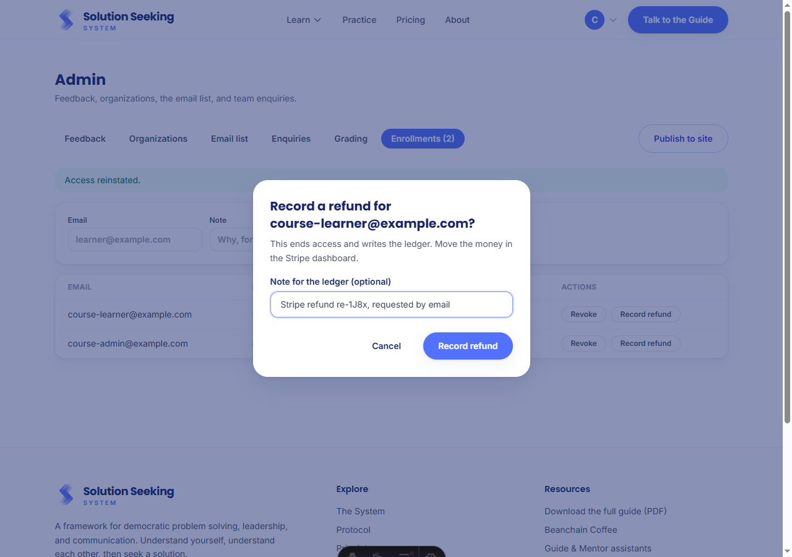 | **`admin-enrollment-note-dialog-1280.png`**: every access change asks for a note first. The note is optional and lands in the ledger beside the admin's id, which is what makes the history readable months later. Cancelling changes nothing. |
|  | **`dashboard-access-ended-1280.png`**: the learner dashboard immediately after a revoke. "Access to the course has ended for this account", no lesson content, matching the 403 every course endpoint now answers. |
|  | **`account-menu-my-course-1280.png`**: the account menu for an enrolled account, offering "My course" into `/course/learn` from the shared per-user entitlement fetch. |
|  | **`account-menu-explore-course-1280.png`**: for an account with no enrollment the entry changes to "Explore the course" and points at the sales page. One entry, never both. |
|  | **`home-course-section-1280.png`**: the home page's course section, whose lesson and module figures come from the catalog at build time rather than being typed. It renders nothing at all while the course is hidden. |
|  | **`pricing-course-panel-1280.png`**: the one-time course panel on `/pricing`, between the subscription plans and Teams, in preview mode so it reads "Opens soon". |
|  | **`certification-page-1280.png`**: `/course/certification`. The criteria and their weights are rendered from `src/data/certification.ts`, the same file the grader reads, so the published rubric and the grade cannot disagree. |
|  | **`certification-page-390.png`**: the rubric at 390px. The criteria table scrolls inside its own box rather than pushing the page sideways, so the weights stay legible next to the criterion they belong to. |
| 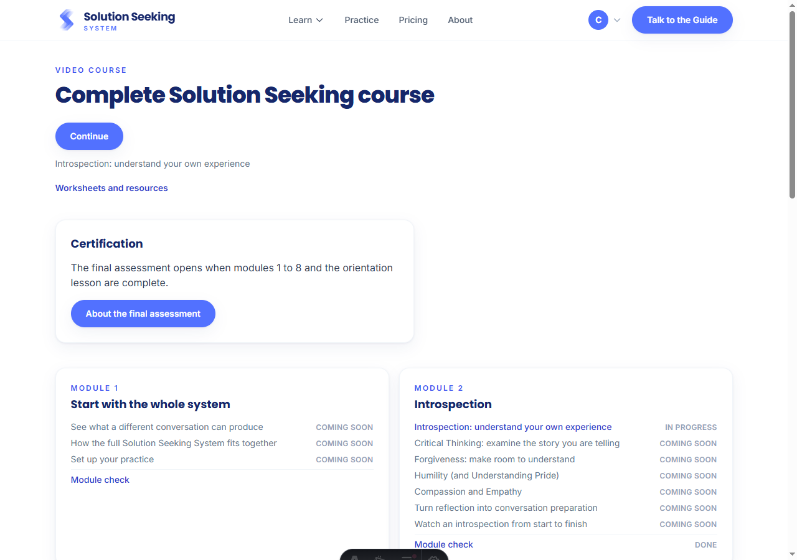 | **`course-dashboard-modules-1280.png`**: where the dashboard stands after Phase 2. Every module card with a check ends in a Module check row, marked Done once both questions have a correct answer, and the header links to the resources page. Module 9 has no row because it has no check. |
| 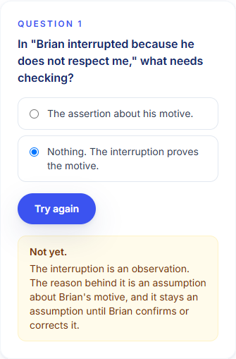 | **`module-check-explanation-390.png`**: a wrong answer at 390px. The explanation the author wrote comes back with the verdict and the button turns into Try again. The correct choice is never sent to the browser, so a wrong pick reveals nothing about the key. |
| 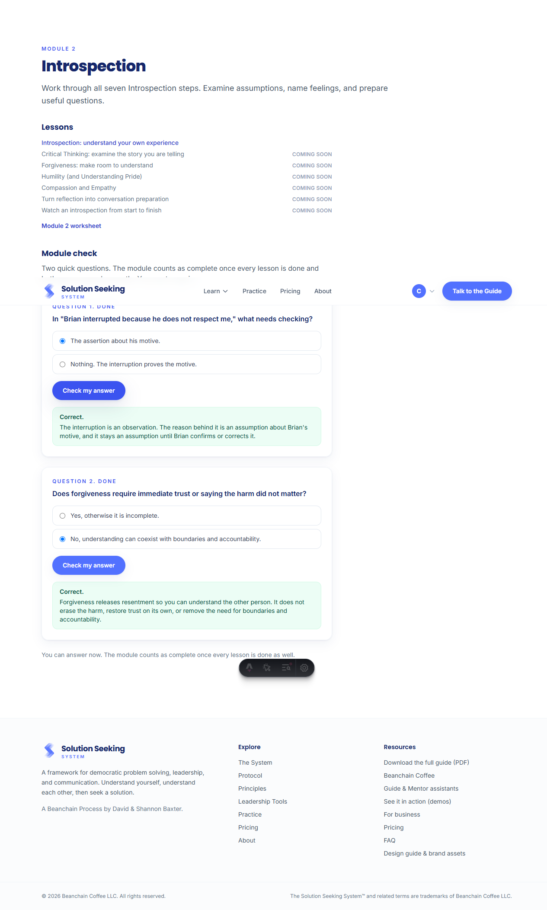 | **`module-check-complete-1280.png`**: both questions answered on the module page. The note underneath says why the module is not complete yet: its lesson still has to be finished, because completion is lessons and checks together. |
| 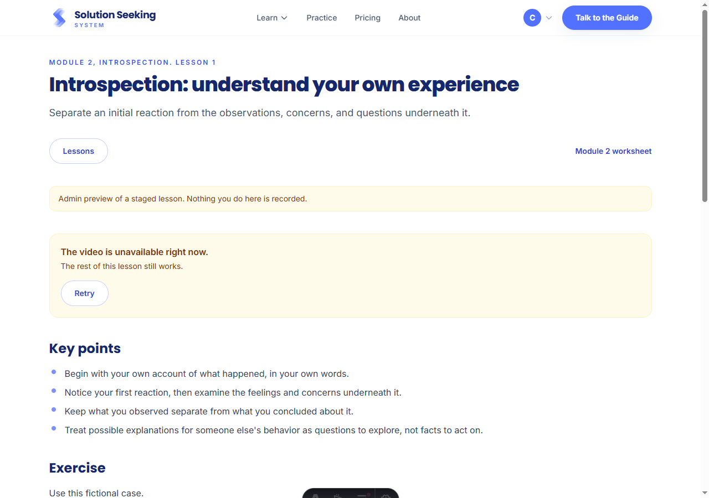 | **`staged-lesson-admin-preview-1280.png`**: a staged lesson opened by an admin with `?preview=1`. The banner names the status, the response box is read-only and no progress action exists, so checking a lesson records nothing. A learner on the same URL gets a 404. |
| 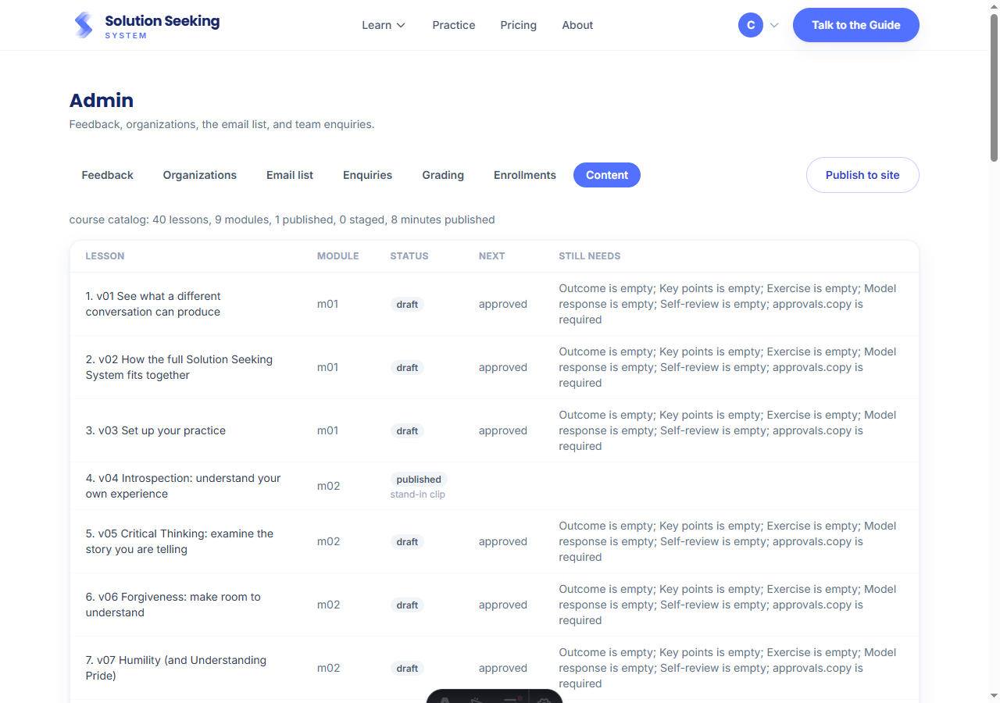 | **`admin-content-ladder-1280.png`**: the Content tab in `/admin`. One row per lesson in chain order, with its status, its next rung and what that rung still needs, produced by the same gate function the build runs, so the tab and the validator cannot disagree. |
| 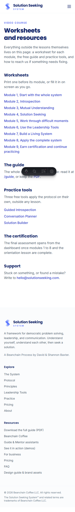 | **`course-resources-390.png`**: every worksheet by module, the free guide, the practice tools and the support address, at 390px. Public data only, so it is a plain prerendered page with no island. |
| 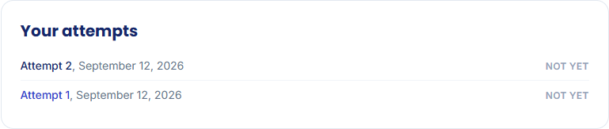 | **`assessment-history-1280.png`**: the history under a result. Attempts are numbered from the first and dated, never named by form; the current one is plain text and the earlier one is a link, so the list never points at the page it is on. |
| 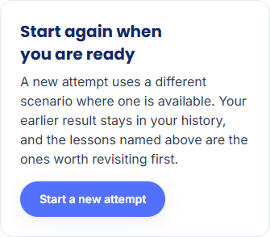 | **`assessment-retake-390.png`**: what follows a not-yet result at 390px. Start a new attempt asks the server for the least-exposed form; when none is left, the server's own sentence about every form having been used appears in place of a new draft. |
| 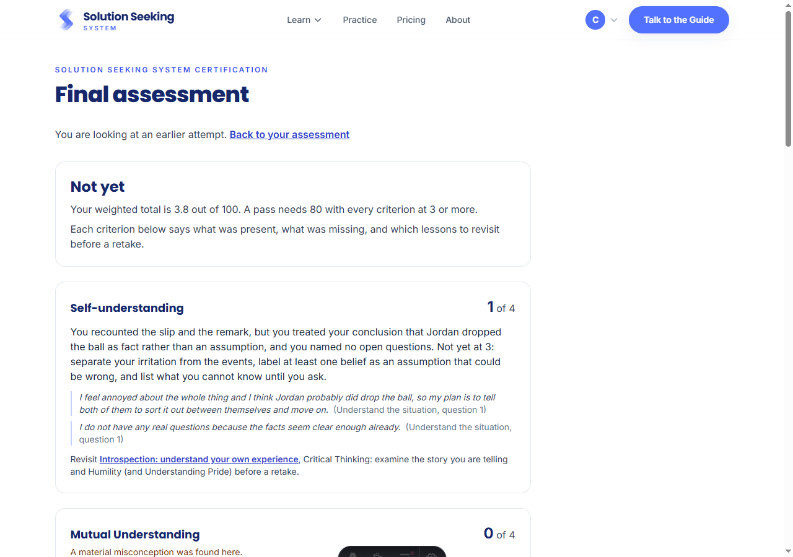 | **`assessment-earlier-attempt-1280.png`**: an earlier attempt opened from the history. One line says which it is and links back; the result renders with its own lower total, and nothing on the page can be edited or submitted. |
| 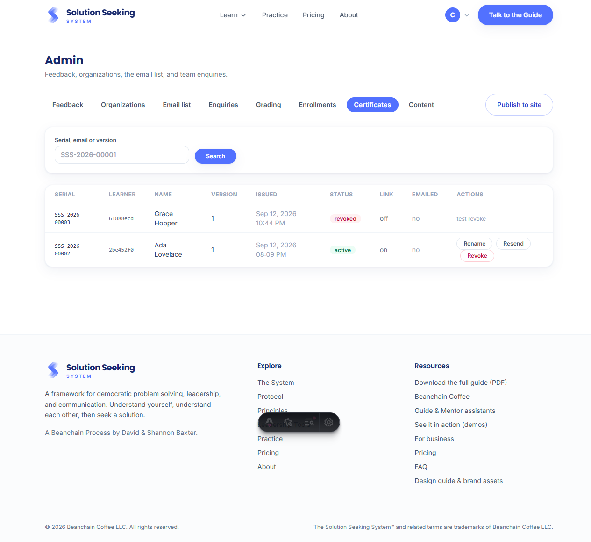 | **`admin-certificates-1280.png`**: `/admin` → Certificates. An active certificate with its Rename, Resend and Revoke actions, beside a revoked certificate showing the reason it was revoked. A revoked row keeps none of those actions, because there is nothing left for any of them to do. |
| 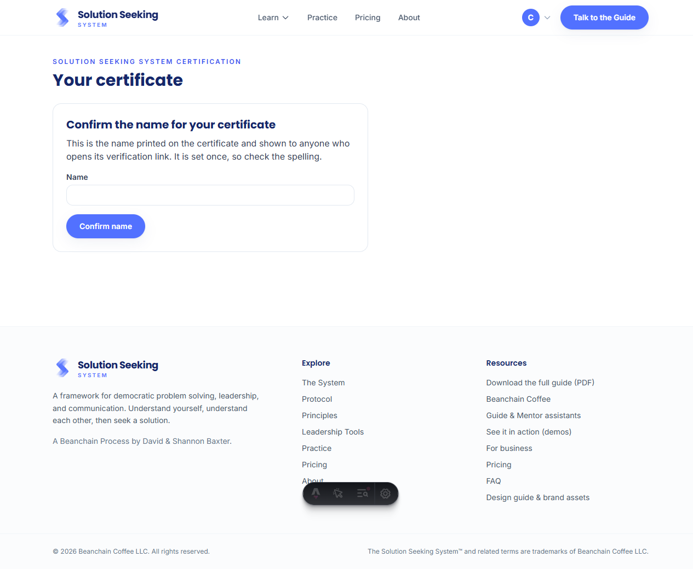 | **`certificate-name-confirmation-1280.png`**: the certificate page before a name is set. This form appears only until a name is confirmed, because the server refuses a second attempt at it, so the printed name is a single decision rather than something to keep tinkering with. |
| 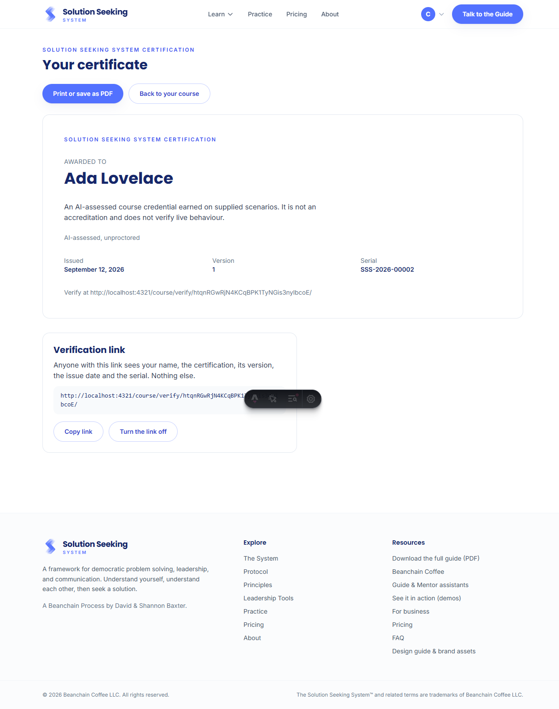 | **`certificate-issued-1280.png`**: the certificate once a name is confirmed. Nothing on the sheet is held back from the verify page, so the printed copy and the page a stranger opens cannot disagree. |
| 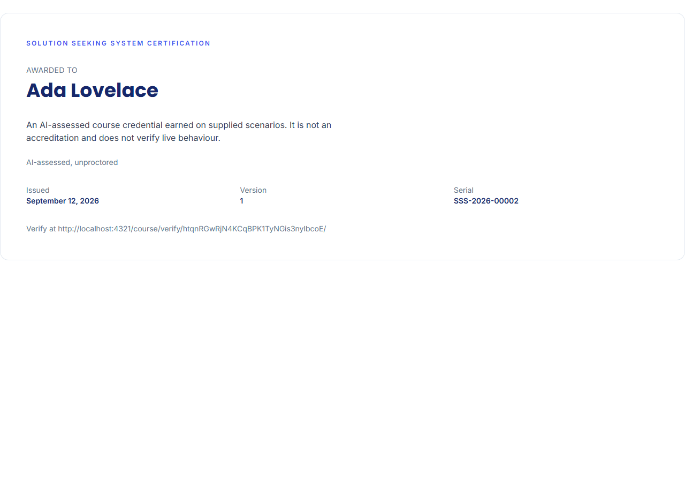 | **`certificate-print-1280.png`**: the same page under print media. The header, footer, nav, the page's own eyebrow and heading, the print button and the verification link section all drop out, leaving the sheet alone as the thing that actually goes onto paper or into a saved PDF. |
| 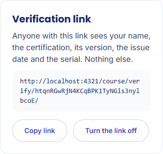 | **`certificate-link-390.png`**: the verification link section at 390px. The sentence above the url is exact about what a stranger sees through it, which matters because this is the piece of a certificate a learner is actively choosing to hand out. |
| 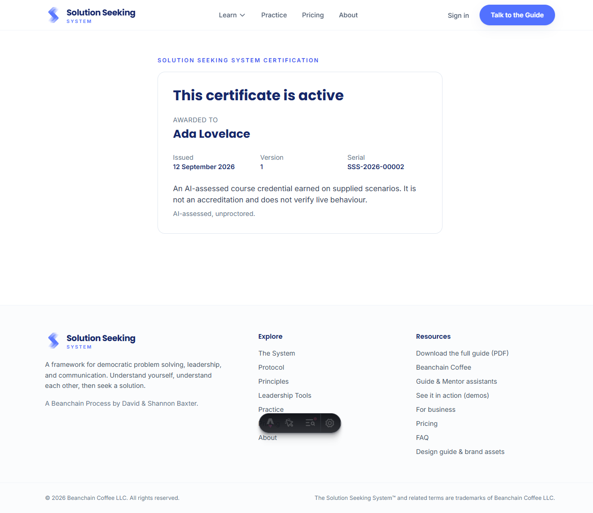 | **`verify-active-1280.png`**: `/course/verify/<token>` for a link that is turned on. A visitor sees exactly what the certificate page promises to show and nothing about who is asking, since the page takes no sign-in and asks nothing of them. |
| 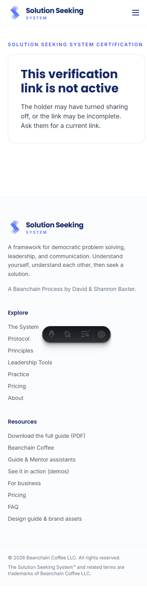 | **`verify-not-active-390.png`**: the same page at 390px for a token that resolves to nothing. A revoked certificate, a link its owner turned off, and a token that was never real all land on this exact page, so no response tells a visitor which one they hit. |

_Captured with a headless Chromium session against the local Supabase stack. The dark pill at
the bottom of some shots is the Astro dev toolbar, not part of the feature. The verification
links visible in the certificate shots point at the local stack, so nobody mistakes them for a
working link on the live site._
