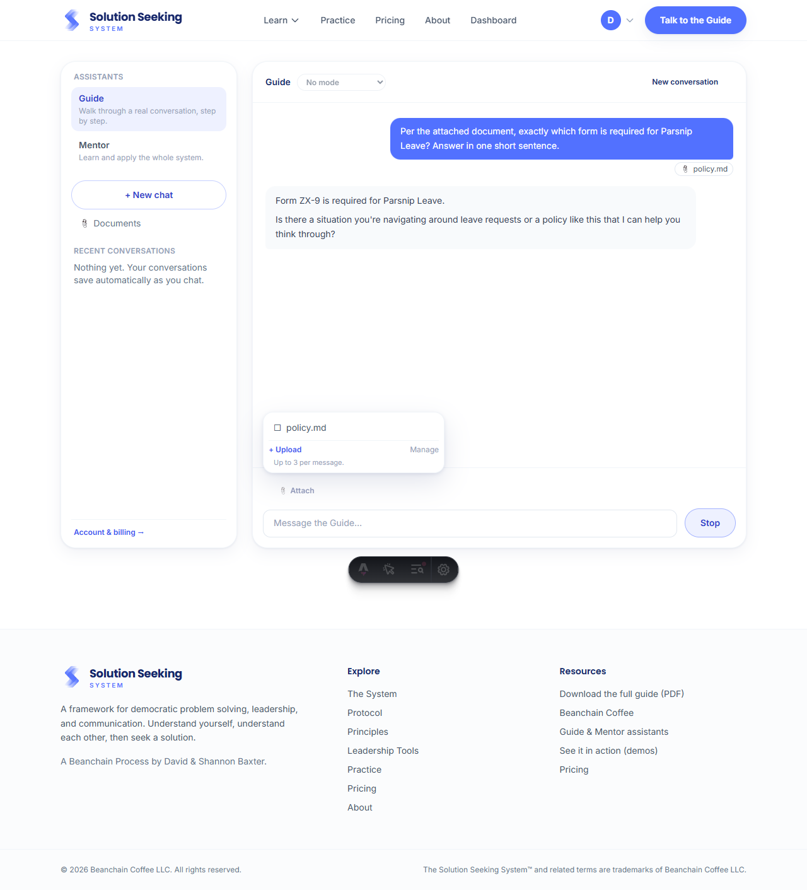
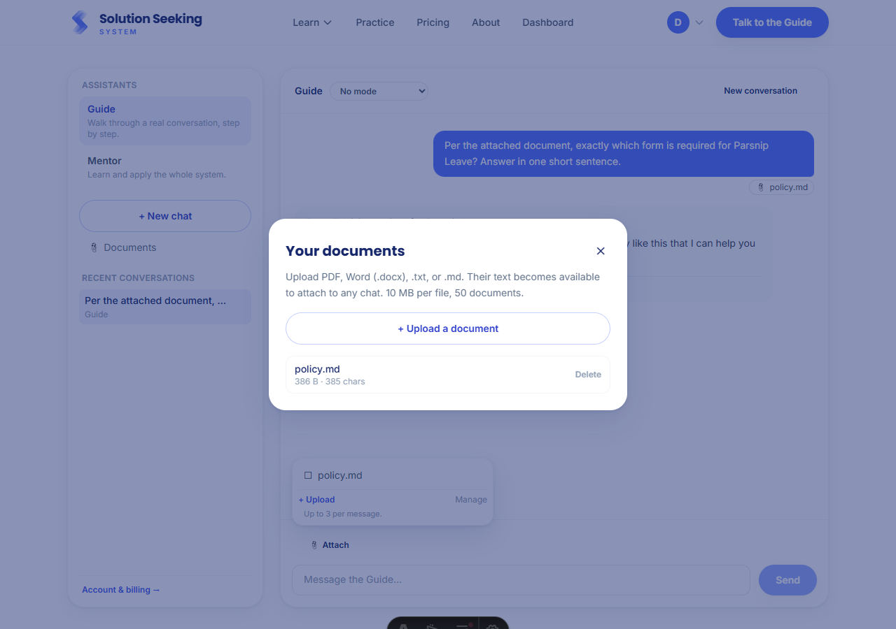

# Document Uploads (Phase B)

Subscribers upload PDF / Word (.docx) / .txt / .md files; the server extracts the text
once, and up to three documents can be attached to any chat message. Verified end to end
in a real browser (Chromium) against local Supabase: uploaded a policy file, attached it,
and the assistant answered a question whose answer appears **only** in that file (proving
the upload → extract → inject → reply pipeline). See
[../../roadmap.md](../../roadmap.md) Phase 5 and [../../architecture.md](../../architecture.md).

| Screenshot | What it shows |
|---|---|
|  | **`attach-and-reply-from-document.png`** — the attach popover picks an uploaded document, the user message carries a 📎 chip, and the assistant answers "Form ZX-9 is required for Parsnip Leave," a fact present only in the attached file. |
|  | **`documents-manager.png`** — the Documents panel (from the sidebar): upload, and see each stored file with its size and extracted character count, with delete. |

_Captured with a headless Chromium session; the dark pill at the bottom is the Astro dev
toolbar, not part of the feature._
