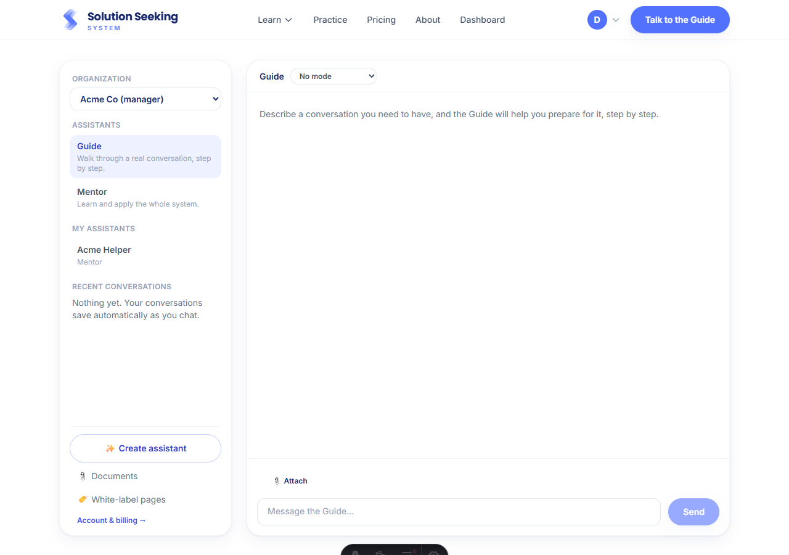
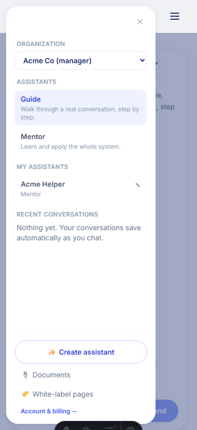

# Multi-org membership + dashboard polish

Prod feedback on the dashboard, addressed together. A person can now belong to **several
organizations** and switch between them; the seat-claim bug is fixed; and a batch of UX
issues (mobile drawer, redundant controls, touch targets) is cleaned up. Verified in a real
browser across a bug-repro account and mobile.

## The seat-claim bug (fixed)

A member who *also* had a personal subscription never claimed their org seat, because
`checkEntitlement` returned `subscriber via stripe` before it reached the claim. Seat-claiming
now lives in `getOrgMemberships` (server) and runs independently of how the user is entitled,
claiming **all** matching seats. Verified: a seeded account with an active personal
subscription + an unclaimed manager seat had `user_id` set (and its manager tools appeared)
right after loading the dashboard.

## Multi-org

Migration 0024 drops the global-unique-email invariant (kept the per-org unique). Membership
is now a list; the dashboard has an **active-org switcher** that drives the "Shared with …"
list, sharing, and the white-label panel. The org id also namespaces white-label URLs
(`/a/<org-id>/<slug>`), so nothing collides across orgs.

| Screenshot | What it shows |
|---|---|
|  | **`org-switcher-desktop.png`** — the "Organization" switcher at the top of the sidebar ("Acme Co (manager)"); the shared assistants and the White-label pages tool follow the active org. Switching to an org where the user is only a member hides the manager tools. |
|  | **`mobile-drawer.png`** — the sidebar as a slide-in **overlay drawer** on mobile (scrim behind, close ✕), replacing the old push-down panel. Also shows the always-visible edit control and the renamed "Create assistant". |

## Other UX fixes

Upload documents from inside the assistant editor; removed the redundant sidebar "New chat"
(the header "New conversation" remains); renamed "New assistant" → "Create assistant";
bounded the chat height on mobile so the composer pins and the transcript scrolls;
made the sidebar edit/delete controls visible on touch; clamped the attach popover width; and
fixed the documents modal to scroll on short screens.

_Captured with a headless Chromium session; the dark pill at the bottom is the Astro dev
toolbar, not part of the feature._
