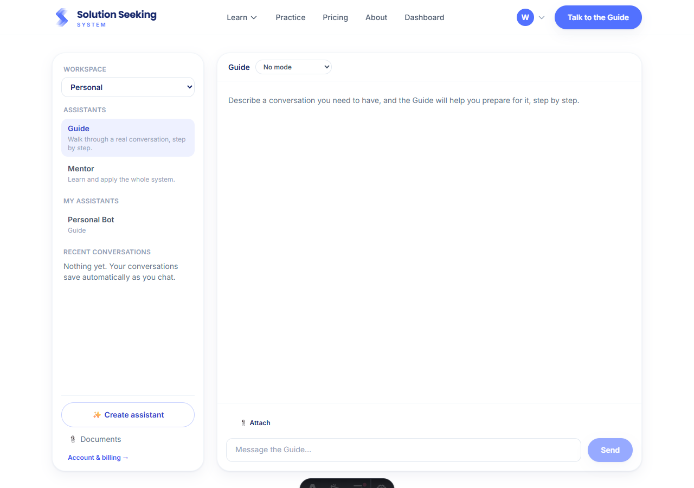
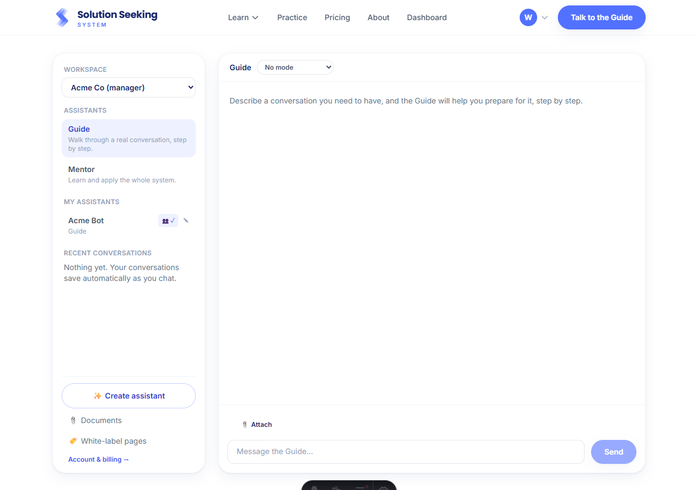
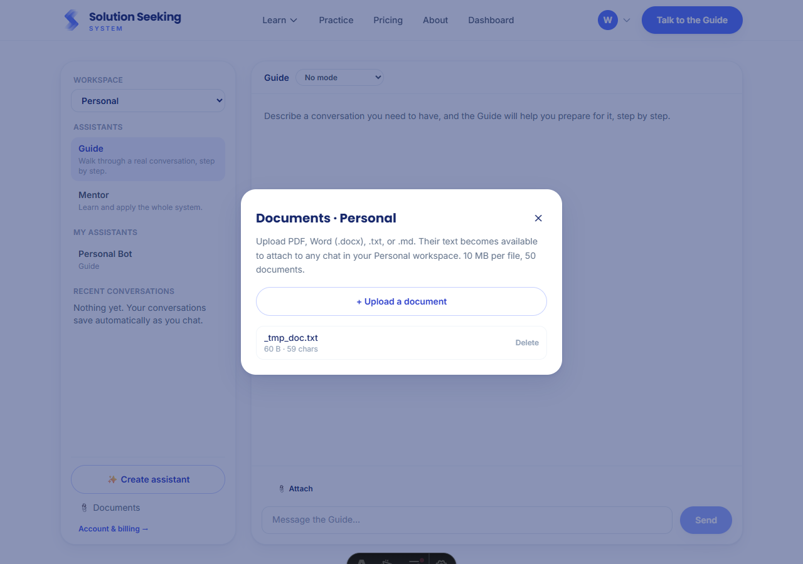
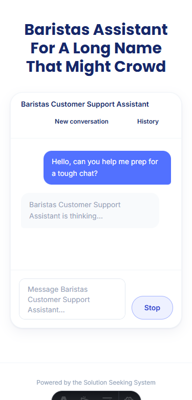

# Org-context workspaces (dashboard)

Prod testing found that switching the active org still showed the assistants you made under
another org, and the document manager showed every document you had ever uploaded, which an
org would object to for confidential reasons. The fix scopes assistants, documents, **and**
conversation history to the **workspace** they were created in: **Personal**, or a specific
organization. The same pass made sharing a one-click action and fixed the white-label chat
header at small widths.

Verified end to end in a real browser (headless Chrome) with one subscriber seeded into
Personal + two orgs (Acme, as manager; Globex, as member).

## What was verified

| Screenshot | What it shows |
|---|---|
|  | **`personal-workspace.png`** — the **Workspace** switcher (always visible now, Personal first). In Personal, only "Personal Bot" shows. |
|  | **`org-workspace-share.png`** — switched to **Acme Co (manager)**: "Personal Bot" is gone (scoping), "Acme Bot" was created here, and the one-click **share toggle** (👥✓) on its row shared it org-wide. The White-label pages tool shows only for a manager. |
|  | **`documents-scoped.png`** — a document uploaded in Personal. Switching to Acme showed an empty document list: uploads follow the active workspace. |
|  | **`white-label-header-mobile.png`** — the white-label chat header at 375px with a long assistant name and both buttons. The name keeps its own line and the buttons drop below it cleanly, instead of smooshing and wrapping mid-word. |

## The model

- A specialized assistant and every uploaded document belong to the workspace active when
  they were created. `assistants.org_id` is now the workspace (null = Personal); a new
  `shared` boolean says whether other members of that org can see it (managers share).
- `documents` and `chat_sessions` gained a nullable `org_id` (migration `0025`), so the
  document library and Recent conversations follow the active workspace too.
- Owners can **move** an assistant to another workspace (Personal, or an org they belong to);
  moving resets sharing, so nothing is silently shared into an org.
- The switcher (`Personal` + each org) drives the whole surface; the choice is remembered in
  `localStorage` (`sss-active-workspace`).

## Verifier results (headless run)

```
switcher:            [ Personal, Acme Co (manager), Globex ]
Personal assistants: [ Personal Bot ]      Acme (before): [ ]        (scoping)
Acme assistants:     [ Acme Bot ]   shared after one click: true
Globex assistants:   [ ]            white-label button: false        (member, not manager)
Personal docs:       [ _tmp_doc.txt ]       Acme docs: [ ]           (scoping)
white-label header @375px: no horizontal overflow, buttons on their own line
```

_The dark strip at the bottom of the mobile shot is the Astro dev toolbar, not part of the page._
