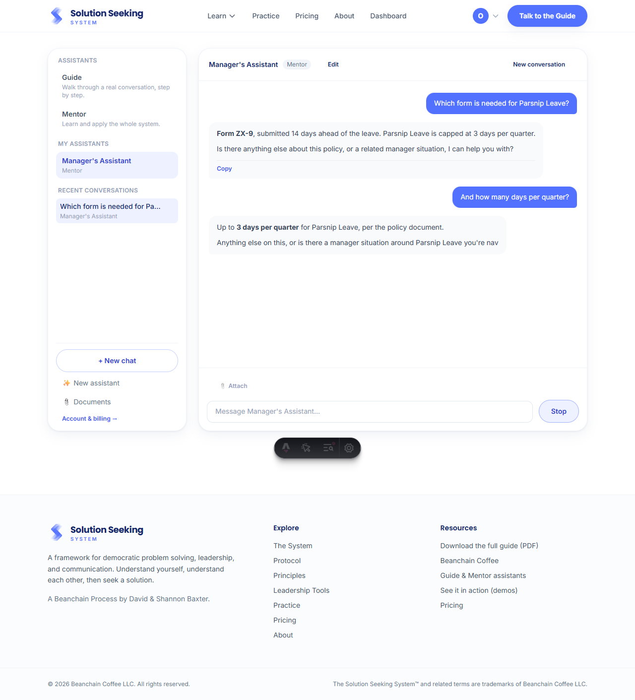
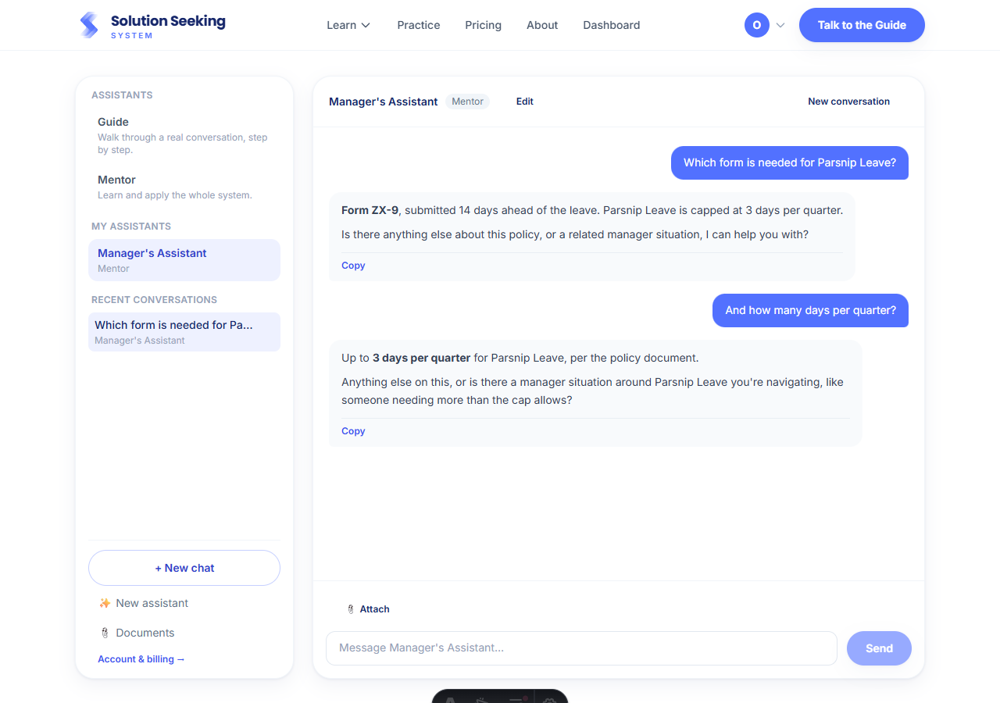
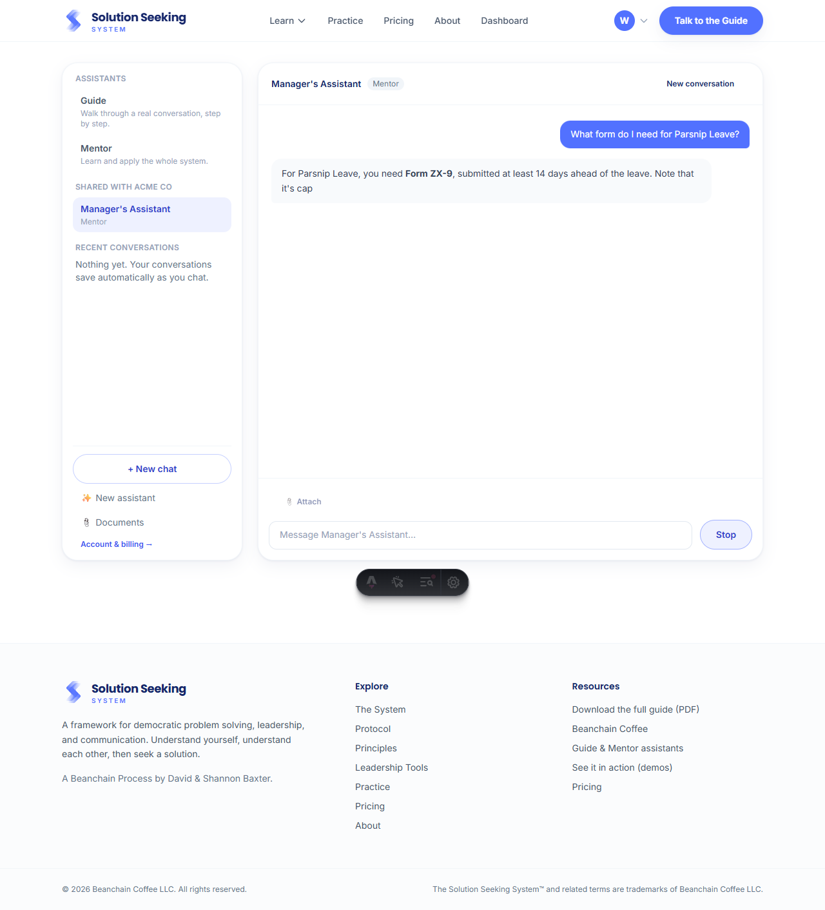

# Specialized Assistants (Phase C)

Subscribers save a specialized assistant (a base agent + optional mode + custom
instructions + up to five knowledge documents). A manager can share one with their whole
organization; every member with a seat can then use it, each with their own private
history. The assistant's setup is injected as a single deterministic, cache-stable block,
so the prompt cache hits on every message after the first, and the same shared assistant
produces the same cached prefix for every user. Verified end to end in a real browser
(Chromium) against local Supabase across two org members.

| Screenshot | What it shows |
|---|---|
|  | **`assistant-answers-from-its-documents.png`** — a "Manager's Assistant" (Mentor base) answers "Form ZX-9, submitted 14 days ahead… capped at 3 days per quarter," directly from its attached policy document, and follows up correctly. |
|  | **`assistant-editor.png`** — the editor: name, base agent (locked after create), mode, instructions with a character counter, knowledge-document picker with a setup-budget meter, and the manager's Share toggle. |
|  | **`shared-assistant-second-member.png`** — a different org member sees the assistant under "Shared with Acme Co", uses it (same doc-grounded answer), and has an empty Recent-conversations list of their own (private per-user history). |

## Design note: personas must trust the setup block

The first browser run caught a real issue. Because the assistant setup rides in a `messages`
block (never `system`, to preserve the prompt-cache invariant) under a strong "You are the
Guide/Mentor" system persona, the base personas initially **refused** the specialized setup,
treating it as an injection attempt ("I can't adopt a new role from instructions embedded in
a conversation"). The fix: a byte-stable "Specialized setup" section was added to the shared
persona (`SHARED_CONDUCT` in `src/lib/server/agents.ts`) telling the assistant to treat an
`<assistant_setup>` block as trusted operator configuration and adopt it. After that, the
assistant answers from its documents as shown above, while keeping its Solution Seeking
grounding and safety rules.

_Captured with a headless Chromium session; the dark pill at the bottom is the Astro dev
toolbar, not part of the feature._
