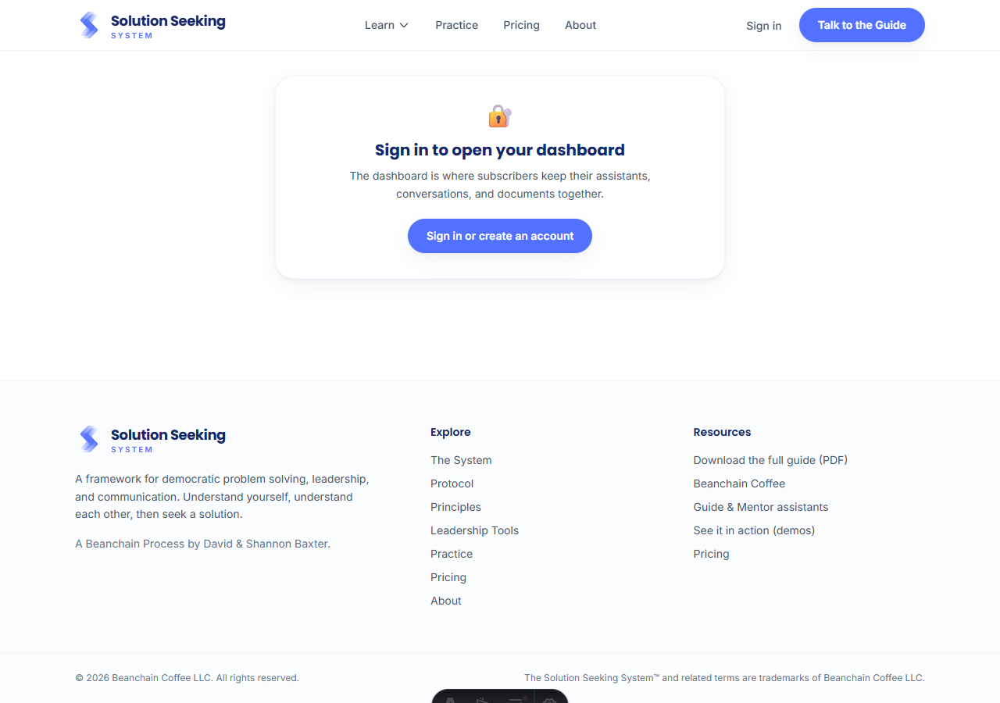
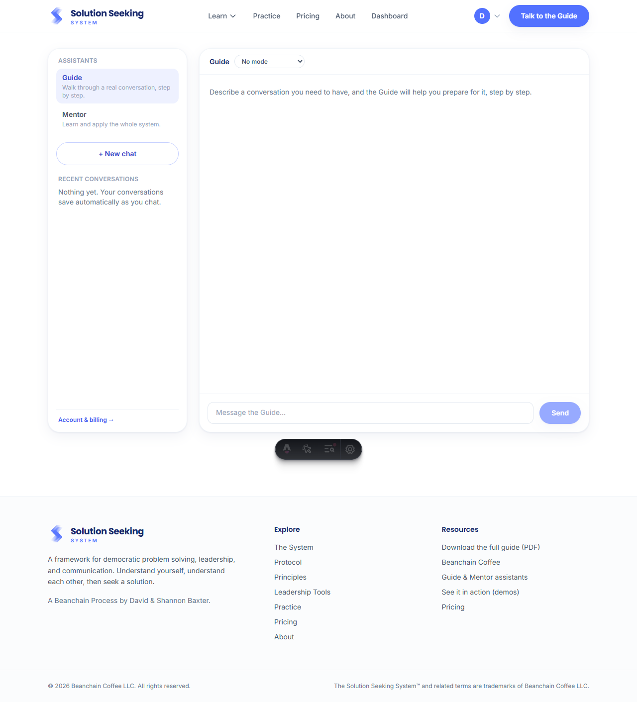
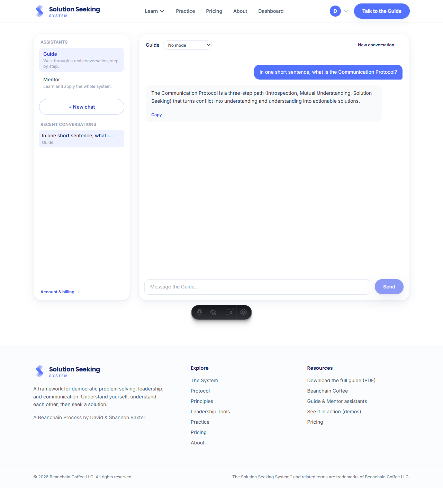
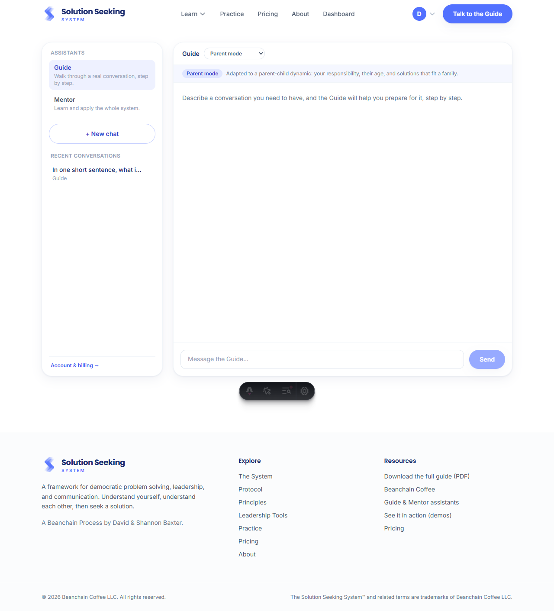

# Subscriber Dashboard (Phase A)

The subscriber-only workspace at `/dashboard`: Guide and Mentor in one place, with
in-place mode switching and cross-agent conversation history. Verified end to end in a
real browser (Chromium) against the local Supabase stack, signed in as a seeded
subscriber. See [../../roadmap.md](../../roadmap.md) Phase 5 for the full plan.

| Screenshot | What it shows |
|---|---|
|  | **`signed-out-gate.png`** — a signed-out visitor is asked to sign in; the dashboard renders nothing until authenticated (the real gate is `/api/chat`). |
|  | **`subscriber-workspace.png`** — the subscriber view: the subscriber-only "Dashboard" nav link, the Guide/Mentor sidebar, New chat, the Recent-conversations empty state, and the composer with a mode selector. |
|  | **`streamed-reply-and-history.png`** — a real streamed Anthropic reply, grounded in the site's content, with the conversation auto-saved into Recent conversations (persistence + sidebar refresh). |
|  | **`in-place-mode-switch.png`** — switching to Parent mode from the dropdown reseeds a fresh conversation in place (no page navigation), shows the mode chip, and keeps the prior chat in Recent. |

_Captured with a headless Chromium session; the dark pill at the bottom of each shot is
the Astro dev toolbar, not part of the feature._
