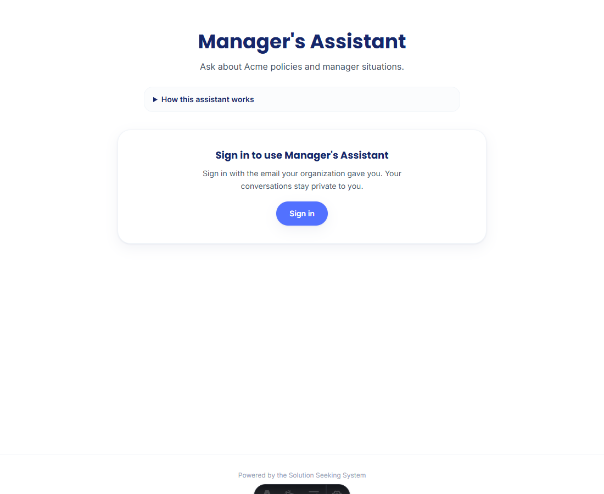
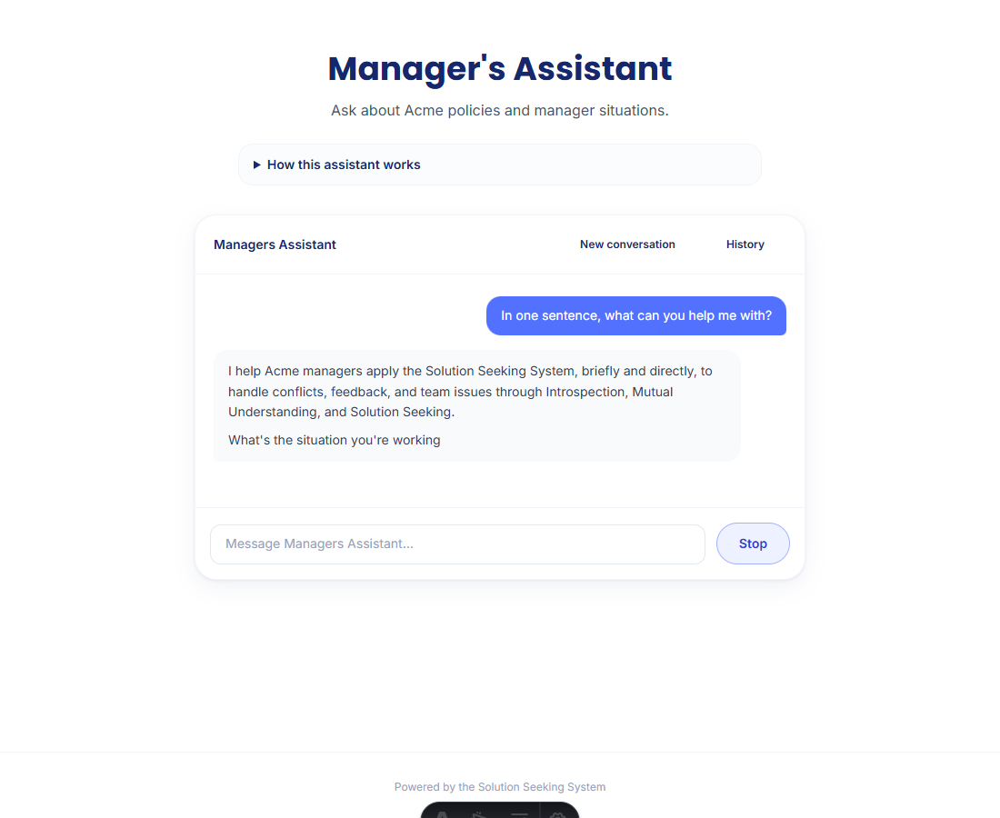
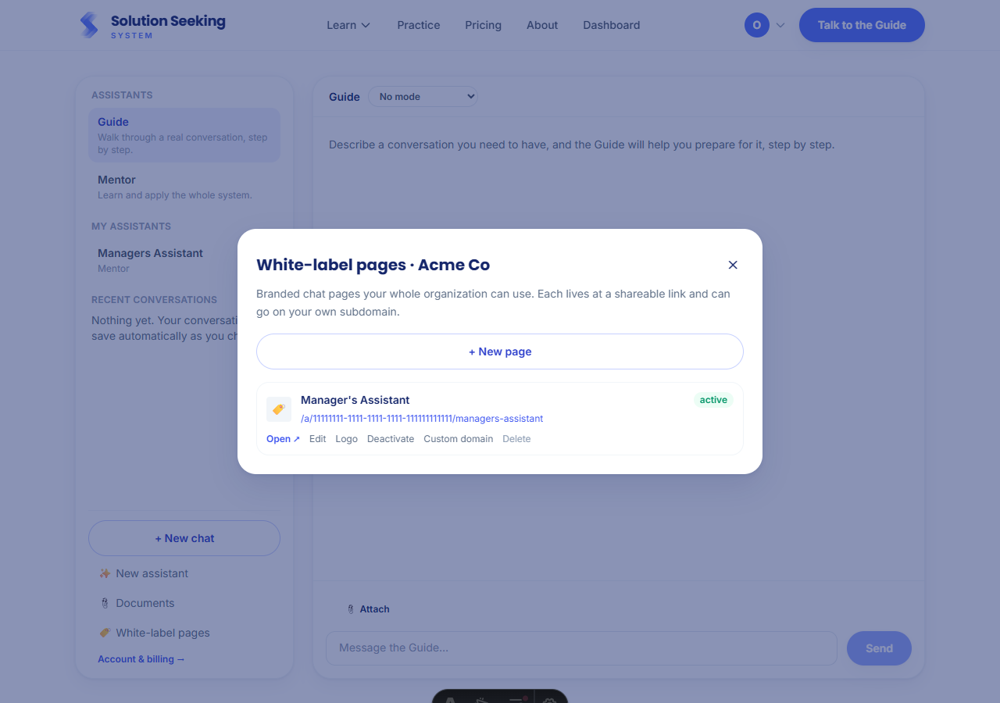

# White-Label Pages (Phase D)

An organization manager can publish a branded chat page at `/a/<org-id>/<slug>` for a
shared assistant (or a standard Guide/Mentor). It carries a title, description, displayed
instructions, and an uploaded logo. Any org member signs in with their own email and uses
it with private history; the page can later be served on the customer's own subdomain via a
concierge CNAME step. Verified end to end in a real browser across a manager and a member.

| Screenshot | What it shows |
|---|---|
|  | **`signed-out-branded-page.png`** — the page at `/a/<org-id>/<slug>`: title, description, a "How this assistant works" note, and a sign-in gate (no anonymous chat). No site header; a "Powered by the Solution Seeking System" footer. |
|  | **`org-member-chat.png`** — a signed-in org member chats on the branded page; the assistant answers per its specialized instructions, with its own History and private conversations. |
|  | **`manager-panel.png`** — the manager-only panel in the dashboard: create pages, copy the link, upload a logo, activate/deactivate, and open the custom-domain (CNAME) instructions. |

## How access works

The page (branded hero + instructions) renders server-side for anyone, but chatting needs
sign-in and entitlement. For a page backed by a **shared specialized assistant**, `/api/chat`
enforces org membership (owner or member of the assistant's org, else a non-probeable 404),
so only the org's people can use it. For a **standard Guide/Mentor** page, a signed-in
visitor gets the normal free-tier/subscription behaviour, same as the public site.

Custom domains are a documented concierge step (Netlify domain alias + a root-only
`netlify.toml` rewrite + Supabase auth + Turnstile allowlisting) — see
[deployment.md](../../deployment.md).

_Captured with a headless Chromium session; the dark pill at the bottom of the manager panel
is the Astro dev toolbar, not part of the feature._
